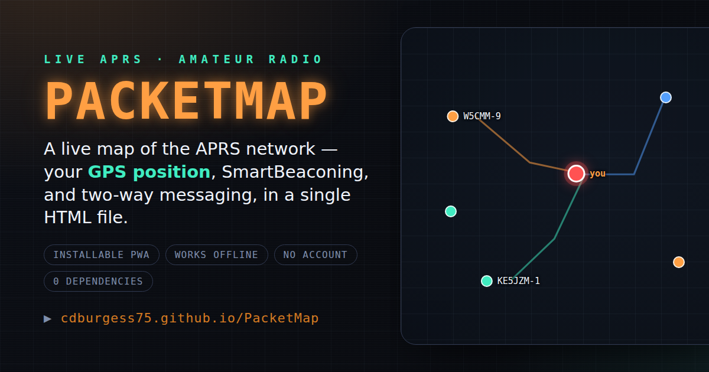
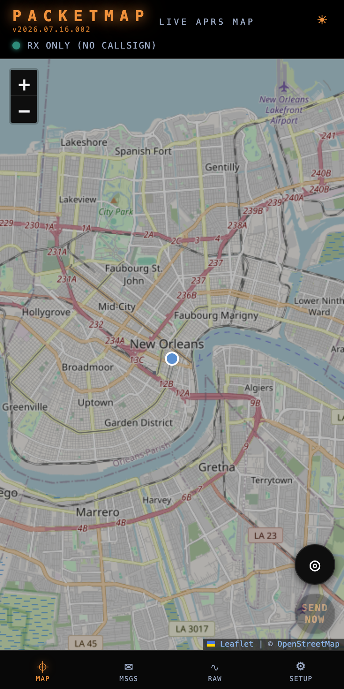
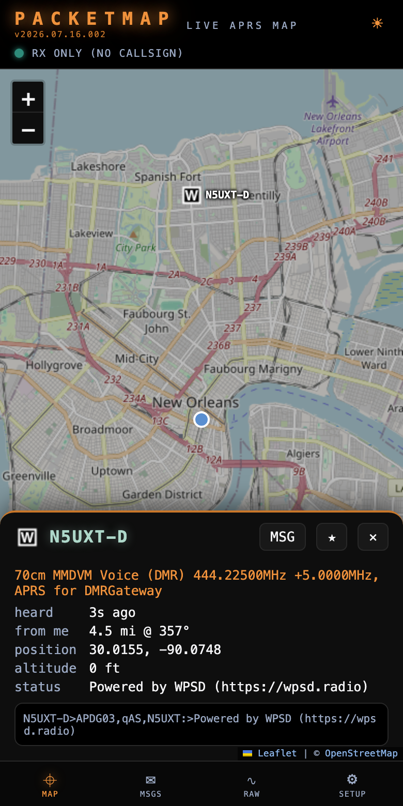
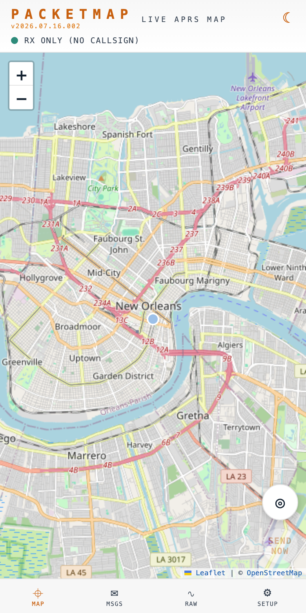

<div align="center">



# PacketMap

**A live APRS map with your GPS position, SmartBeaconing, and two-way messaging - in a single-file PWA that installs from the browser, works offline, and needs no account.**

[](https://github.com/cdburgess75/PacketMap/actions/workflows/smoke.yml)
[](https://github.com/cdburgess75/PacketMap/commits/main)
[](#architecture)
[](LICENSE)

**[▶ Open the live app](https://cdburgess75.github.io/PacketMap/)**

Part of the same family as [PileUp](https://github.com/cdburgess75/PileUp) (POTA/SOTA log) and [SkyWave](https://github.com/cdburgess75/SkyWave) (shortwave guide).

</div>

---

## Table of contents

- [Overview](#overview)
- [Key features](#key-features)
- [How it connects](#how-it-connects)
- [Architecture](#architecture)
- [Getting started](#getting-started)
- [Using PacketMap](#using-packetmap)
- [Running the tests](#running-the-tests)
- [Contributing](#contributing)
- [License](#license)

---

## Overview

**APRS** (Automatic Packet Reporting System) is amateur radio's tactical data network: thousands of stations beacon their position, weather, and short messages over RF, and internet gateways merge it all into the worldwide **APRS-IS** feed. PacketMap puts that live feed on a map in your pocket - centered on *you*.

**The problems it solves:**

| Problem | PacketMap's answer |
|---|---|
| APRS map sites are server-rendered pages that need connectivity and a big screen | Installable PWA built mobile-first: the app shell and map tiles you've seen work offline |
| Watching the network usually means being invisible on it | Enter your callsign and flip **Transmit**: SmartBeaconing puts you on the air (and on aprs.fi) from your phone's GPS |
| Web maps show positions but hide the protocol | Tap any station for its decoded weather, course, altitude - and the raw packet; the RAW tab streams the live feed |
| Messaging needs a radio or a paid app | Full two-way APRS messaging with automatic acks and retries, right from the map |
| Browsers can't speak the APRS-IS TCP protocol | It connects straight to a native APRS-IS WebSocket endpoint - no bridge to host; a self-hosted Cloudflare Worker stays as an optional fallback |

**Why it stands out:** the entire application is one HTML file with zero runtime dependencies - no framework, no bundler, no build step, no account, no tracking. Your callsign, tracks, and messages never leave your device except as the packets you deliberately transmit.

<div align="center">

| Live map + your GPS | Station detail | Light theme |
|:---:|:---:|:---:|
|  |  |  |

</div>

## Key features

| Area | Functionality |
|---|---|
| **Live map** | Real-time APRS-IS feed rendered on OpenStreetMap with authentic APRS symbols; the server-side filter follows your GPS (radius configurable 10-500 km) |
| **Your position** | Live blue dot with accuracy circle, follow-me mode, auto-centering on first fix |
| **Beaconing** | SmartBeaconing (speed-scaled rate + corner pegging), one-tap **SEND NOW**, master TX switch, configurable symbol / SSID / comment |
| **Messaging** | Conversation threads per callsign, 67-char composer, automatic `{id}` sequencing, 3x retries until ack, incoming auto-ack, unread badges |
| **Station detail** | Distance and bearing from you, course/speed/altitude, decoded weather (temp, wind, rain, baro), status text, and the raw packet |
| **Track tails** | Color-coded polylines for moving stations, persisted on-device (IndexedDB, 7-day retention) and re-seeded on launch |
| **Watchlist** | Star callsigns (prefix `*` supported); banner + system notification when they're heard or message you |
| **Raw console** | Live packet stream with filter, pause, and a 2000-line ring buffer - the whole protocol, visible |
| **Packet parser** | Uncompressed, compressed (base91), Mic-E, objects, items, weather, status, messages - all decoded client-side |
| **UI** | Dark/light themes (☀ toggle in the header), phosphor-glow dark mode matching PileUp, mobile-first layout |
| **Offline** | Service-worker shell cache, map-tile cache (1500 tiles, oldest trimmed), update banner on new releases |
| **Privacy** | Receive-only needs no callsign at all; all data stays in your browser |

## How it connects

Browsers can't open TCP sockets, and the core APRS-IS pool (`rotate.aprs2.net:14580`) is plain-text TCP only. But APRS-IS servers running `javAPRSSrvr` expose a **native WebSocket port**, and at least one serves it over **TLS** - so PacketMap connects straight to the network with **nothing to host**:

```
┌─────────────────┐   WebSocket (wss)   ┌────────────────────────────┐
│  PacketMap PWA  │ ◄─────────────────► │   APRS-IS  (javAPRSSrvr)    │
│  (your browser) │  login · filter ·   │   wss://ametx.com:8888      │
└─────────────────┘  parse · TX         │   a node on the world feed  │
                                         └────────────────────────────┘
```

The app speaks the standard APRS-IS protocol itself - login, passcode computation, radius filter, packet parsing, and (with a callsign) transmit - directly over the WebSocket, exactly as it would over raw TCP. Receive-only needs no callsign and no account.

**Failover & custom servers.** The built-in endpoint list is tried in order: the app skips any server it can't reach and stays put once logged in. **SETUP → Network → Server** overrides it with your own `wss://` APRS-IS endpoint - or a self-hosted bridge (below), which then takes priority with the built-in endpoint as backup. Leave it blank for the built-in direct feed.

### Optional: self-hosted Cloudflare Worker

Prefer not to depend on a public endpoint - or want the resilience of the round-robin `rotate.aprs2.net` pool? `worker/` is a ~70-line Cloudflare Worker (free tier) that pipes WebSocket to APRS-IS TCP. It's a **dumb pipe**: all APRS logic stays in the app, and the upstream host is hardcoded so it can't be abused as an open proxy.

```bash
cd worker
npx wrangler login
npx wrangler deploy
```

Paste the printed `wss://packetmap-bridge.<you>.workers.dev` URL into **SETUP → Network → Server**. On `localhost` the app uses `ws://127.0.0.1:8787` for development (run `npx wrangler dev --local` in `worker/`).

## Architecture

```
PacketMap/
├── index.html                   # The entire app - markup, styles, and logic in one file
│     ├─ vendored Leaflet 1.9.4  #   (BSD-2-Clause, marked block - do not hand-edit)
│     ├─ APRS symbol sprites     #   (hessu/aprs-symbols, CC BY 4.0, base64)
│     └─ app code                #   parser · APRS-IS client · map · beaconing · messaging
├── sw.js                        # Service worker: app-shell cache + OSM tile cache
├── worker/                      # Cloudflare Worker bridge (WebSocket ↔ APRS-IS TCP)
├── manifest.webmanifest         # PWA manifest (icons, theme, display mode)
├── icons/                       # App icons (SVG + PNG) and social-preview image
├── docs/                        # Screenshots used by this README
├── test/
│   └── smoke.mjs                # Smoke suite: syntax, DOM ids, jsdom boot, parser, versions
└── .github/workflows/smoke.yml  # CI - runs the smoke suite on every push and PR
```

**Persistence:** settings in `localStorage`; track history, messages, and the raw log in IndexedDB. **Network access** is pinned by a `Content-Security-Policy` meta tag to exactly OSM tiles, the direct APRS-IS WebSocket endpoint(s), and any `*.workers.dev` bridge.

## Getting started

### As an operator (no install)

Open **<https://cdburgess75.github.io/PacketMap/>** - that's it. To pin it as an app:

| Platform | Steps |
|---|---|
| iOS / iPadOS | Safari → Share → **Add to Home Screen** |
| Android | Chrome → ⋮ → **Add to Home Screen** |
| Desktop | Chrome / Edge → install icon in the address bar |

### As a developer

**Prerequisites:** [Node.js](https://nodejs.org/) ≥ 18 (for the test suite only - the app itself needs nothing but a browser).

```bash
git clone https://github.com/cdburgess75/PacketMap.git
cd PacketMap
npm install                          # dev-only dependency: jsdom
npx serve .                          # any static server works
cd worker && npx wrangler dev --local  # optional: local APRS-IS bridge on :8787
```

Open `http://localhost:3000`. With the local bridge running, the app connects to it automatically; otherwise point **Setup → Network → Server** at a `wss://` endpoint (e.g. the built-in `wss://ametx.com:8888`) to pull the direct feed. Either way, New Orleans traffic starts flowing - the default map center always has stations on the air.

## Using PacketMap

Four tabs along the bottom: **⌖ Map**, **✉ Msgs**, **∿ Raw**, and **⚙ Setup**. The version is shown under the **PACKETMAP** wordmark; an update banner slides up when a new release deploys. The ☀/☾ button in the header flips light/dark.

### First run

1. Allow the **location** prompt - the map centers on you and the feed follows your GPS.
2. Open **⚙ Setup → My station** and enter your **callsign** and SSID (**-9** mobile, **-7** HT, **-5** phone). Pick your **symbol** and beacon text.
3. The header LED goes green: `<CALL> VERIFIED` means you're logged in and can transmit; receive-only mode works with no callsign at all.

### Going on the air

- Flip **Transmit** in Setup (or leave it off to lurk). The **TX** badge in the header confirms it.
- **SEND NOW** on the map beacons immediately; SmartBeaconing handles the rest - every 20 min parked, up to once a minute at highway speed, plus a beacon on every real turn.
- Check yourself on [aprs.fi](https://aprs.fi/) - you're a real station now.

### Messaging

Tap a station → **MSG**, or start one by callsign in the Msgs tab. Sent messages show **sending → ✓ ack** as the other station confirms. Incoming messages are acked automatically and badge the tab.

### Watching friends

Tap the **★** on any station panel, or add callsigns (prefix `*` ok) in Setup. Watched stations get a star on the map and fire an alert (plus an optional system notification) when they appear or write to you.

## Running the tests

```bash
npm test
```

The smoke suite (`test/smoke.mjs`) runs five checks in about a second:

| # | Check | Catches |
|---|---|---|
| 1 | App script parses (`new Function`) | Syntax errors anywhere in the app |
| 2 | Every `$()` / `getElementById` call has a matching `id=""` | Typos between markup and logic |
| 3 | Full boot inside jsdom | Runtime errors on startup, missing elements |
| 4 | Parser vectors: real position / weather / Mic-E / message packets + passcode | Protocol regressions |
| 5 | `VERSION` === `sw.js` cache name === README badge | Version drift between app, cache, and docs |

The same suite runs in CI on every push and pull request via [GitHub Actions](.github/workflows/smoke.yml).

## Contributing

Contributions are welcome. To keep the project true to its design goals:

1. **Open an issue first** for anything beyond a small fix, so the approach can be agreed before you invest time.
2. **Respect the constraints** - single file, zero runtime dependencies, no build step, no APRS logic in the Worker.
3. **Match the existing style** - compact vanilla JS, CSS custom properties for theming (dark and light).
4. **Never weaken the TX gate** - anything that transmits goes through `canTx()`.
5. **Run `npm test`** before pushing; CI runs the same suite on your PR.

## License

Released under the [MIT License](LICENSE).

**Credits:** map data © [OpenStreetMap](https://www.openstreetmap.org/copyright) contributors · [Leaflet](https://leafletjs.com/) © Vladimir Agafonkin (BSD-2-Clause) · APRS symbols from [hessu/aprs-symbols](https://github.com/hessu/aprs-symbols) (CC BY 4.0) · APRS is a registered trademark of Bob Bruninga, WB4APR (SK).

---

<div align="center">
<sub>73 📻</sub>
</div>
