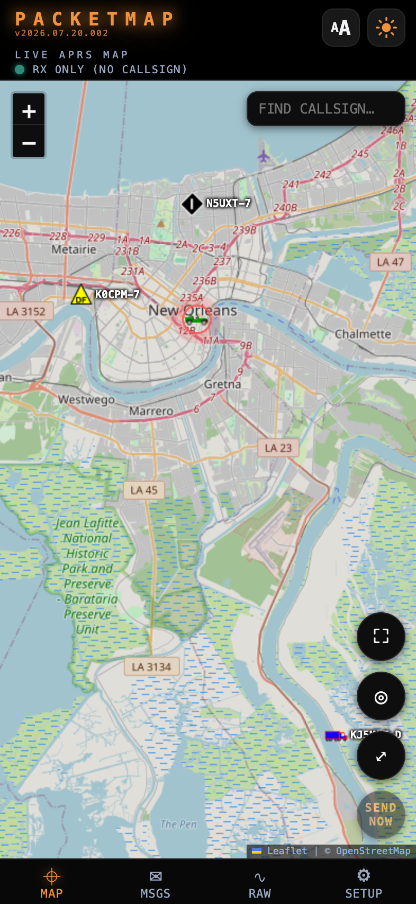
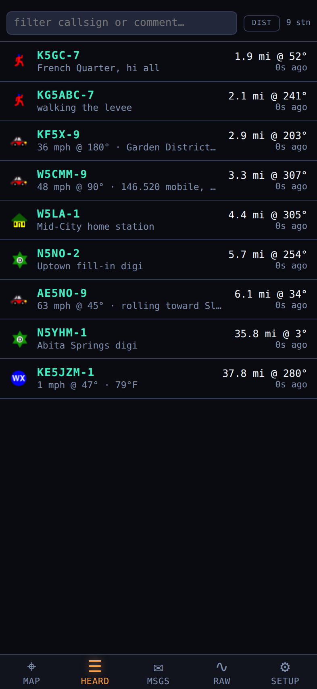
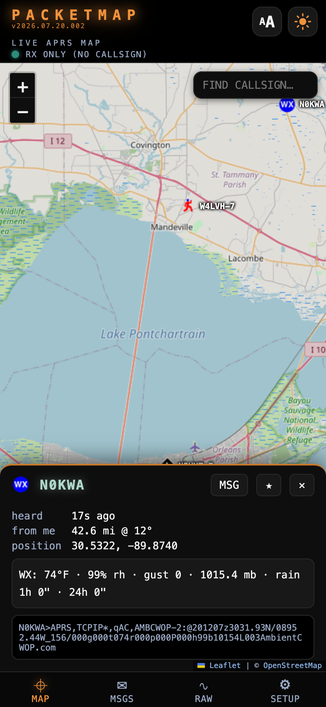
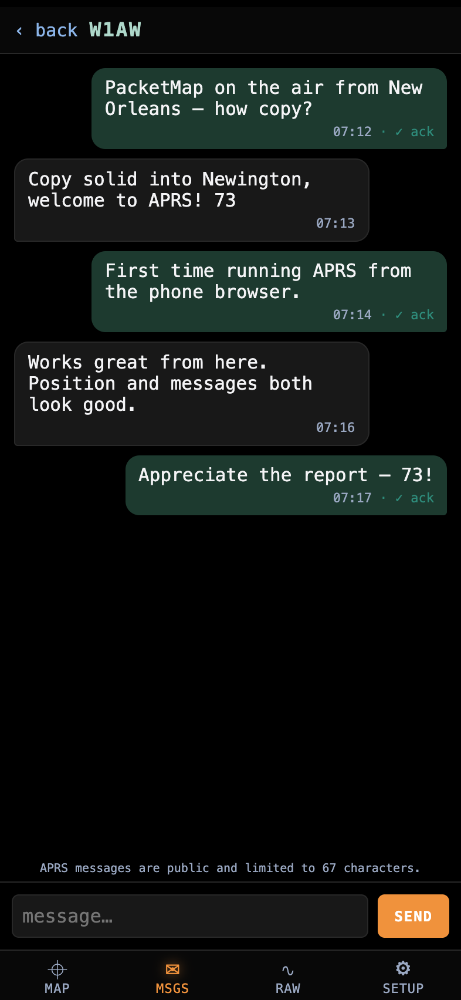
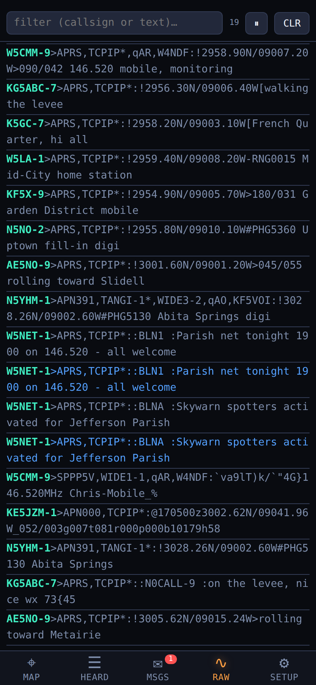
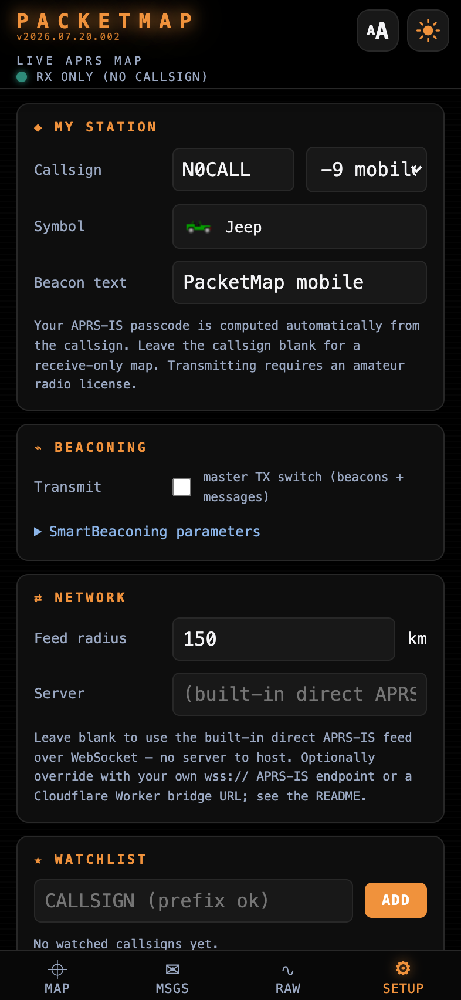
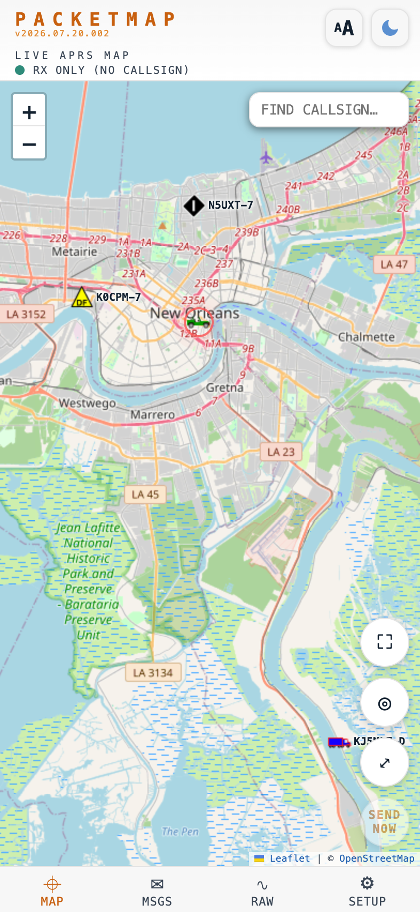

<div align="center">


<br><br>

**A live APRS map with your GPS position, SmartBeaconing, and two-way messaging — in a single HTML file that installs from the browser, works offline, and needs no account.**

[](https://cdburgess75.github.io/PacketMap/)
[](https://github.com/cdburgess75/PacketMap/actions/workflows/smoke.yml)
[](CHANGELOG.md)
[](#install)
[](#tech-stack)
[](LICENSE)

### [▶ Open the live app](https://cdburgess75.github.io/PacketMap/)

<sub>Part of the same family as [PileUp](https://github.com/cdburgess75/PileUp) (POTA/SOTA log) and [SkyWave](https://github.com/cdburgess75/SkyWave) (shortwave guide).</sub>

</div>

---

## Overview

**APRS** (Automatic Packet Reporting System) is amateur radio's tactical data network: thousands of stations beacon their position, weather, and short messages over the air, and internet gateways merge it all into the worldwide **APRS-IS** feed. PacketMap puts that live feed on a map in your pocket — centered on *you* — and lets you join in with nothing but a browser.

The whole application is **one `index.html` file** with zero runtime dependencies: no framework, no bundler, no build step, no account, no tracking. It connects straight to an APRS-IS WebSocket endpoint, so there's **no server or bridge for you to host**. Your callsign, tracks, and messages stay on your device except as the packets you deliberately transmit.

| Instead of… | PacketMap gives you… |
|---|---|
| A server-rendered map site that needs a big screen and a connection | An installable PWA, built mobile-first, whose shell and seen map tiles work offline |
| Watching the network while staying invisible on it | Your callsign + a Transmit switch — SmartBeaconing puts you on the air (and on [aprs.fi](https://aprs.fi/)) from your phone's GPS |
| A map that hides the protocol behind it | Tap any station for decoded weather, course, and altitude — plus the raw packet; the RAW tab streams the live feed |
| Messaging that needs a radio or a paid app | Full two-way APRS messaging with automatic acks and retries |
| Standing up a proxy to reach APRS-IS from a browser | A direct WebSocket connection — nothing to deploy |

## Screenshots

<div align="center">



<sub>Live APRS map — stations around you, your own position as your APRS symbol<br>
<i>(the two map captures predate the Heard tab; the rest are current)</i></sub>

<br><br>

<table>
<tr>
<td align="center" width="33%"><br><sub>Heard list, sorted by distance</sub></td>
<td align="center" width="33%"><br><sub>Station detail: 24 h weather history</sub></td>
<td align="center" width="33%"><br><sub>Two-way messaging with acks</sub></td>
</tr>
<tr>
<td align="center" width="33%"><br><sub>Live raw packet console</sub></td>
<td align="center" width="33%"><br><sub>Setup: callsign, symbol, transmit</sub></td>
<td align="center" width="33%"><br><sub>Light theme</sub></td>
</tr>
</table>

</div>

## Features

| Area | What it does |
|---|---|
| **Live map** | Real-time APRS-IS feed on OpenStreetMap with authentic APRS symbols; the server-side filter follows your GPS. Adjustable feed radius (10–500 km), callsign-label toggle, icon-size slider, callsign search, and one-tap fit-to-stations. |
| **Heard list** | A sortable roster of every station on the map — by distance, recency or callsign — with symbol, distance and bearing, speed and comment. Filter as you type; tap a row to jump to it on the map. Often faster than hunting for an icon. |
| **Your position** | Live self-marker that shows *your* selected APRS symbol inside a coral "you" ring, with accuracy circle and follow-me mode. No GPS? Long-press the map to set your position by hand. |
| **Beaconing** | SmartBeaconing (speed-scaled rate + corner pegging — ~20 min parked, up to once a minute at highway speed), one-tap **SEND NOW**, a master Transmit switch, and configurable symbol / SSID / comment. Your APRS-IS passcode is computed automatically from your callsign. |
| **Messaging** | Conversation threads per callsign, 67-char composer, automatic `{id}` sequencing, retries until acked (3× / 30 s), incoming auto-ack, and unread badges. |
| **Station detail** | Distance and bearing from you, course / speed / altitude, advertised range, decoded weather, status text, and the raw packet — plus one-tap **navigate** (Apple/Google Maps), **share**, and **GPX** export of that station's track. |
| **Weather history** | Weather stations get 24-hour sparklines for temperature, barometer, wind and humidity, drawn inline from on-device history — no chart library, no server. |
| **NWS alerts** | Active US National Weather Service watches and warnings drawn as severity-coloured polygons. Alerts covering *your* position are drawn solid, pin a standing bar to the top of the map, and raise a notification; the rest of your state is dashed. A ⚠ map button opens the full list — event, area, expiry and headline, worst first — and tapping one frames its outline. Optional, US only. |
| **Map intelligence** | Range circles from a station's own PHG / RNG data, and dead-reckoned ghost markers projecting where a moving station should be now. Both toggleable. |
| **Forecast on demand** | One tap messages **WXBOT**, a long-running APRS robot, with your coordinates; the forecast comes back as a message reply. Uses no API and no extra host — and over RF it works with no internet at all. |
| **Bulletins** | `BLN0`–`BLN9` / `BLNA`–`BLNZ` broadcasts — net announcements, club notices, relayed weather — collected at the top of Messages, keyed by sender and slot. |
| **Track tails** | Colour-coded polylines for moving stations, persisted on-device (IndexedDB, 7-day retention), re-seeded on launch, and exportable as GPX. |
| **Watchlist** | Star callsigns (prefix `*` supported); a banner and optional system notification fire when they're heard or message you. |
| **Raw console** | Full-screen live packet stream with filter, pause, and a 2000-line ring buffer — the whole protocol, visible. |
| **Packet parser** | Uncompressed, compressed (base91), Mic-E, objects, items, weather, status, messages, bulletins, PHG/RNG, and the `!DAO!` precision addendum — all decoded in the browser. |
| **Interface** | Dark and light themes, small / medium / large text sizing, a full-screen map with screen-wake-lock, and full-screen Messages / Raw tabs. |
| **Offline** | Service-worker shell cache, OSM tile cache (1500 tiles, trimmed oldest-first), and an update banner when a new release ships. |
| **Privacy** | Receive-only mode needs no callsign at all; nothing leaves your browser unless you transmit. |

## How it connects

Browsers can't open raw TCP sockets, and the core APRS-IS pool (`rotate.aprs2.net:14580`) is plain-text TCP only. But APRS-IS servers running `javAPRSSrvr` expose a **native WebSocket port**, and at least one serves it over **TLS** — so PacketMap connects straight to the network with **nothing to host**:

```
┌─────────────────┐   WebSocket (wss)   ┌────────────────────────────┐
│  PacketMap PWA  │ ◄─────────────────► │   APRS-IS  (javAPRSSrvr)   │
│  (your browser) │  login · filter ·   │   wss://ametx.com:8888     │
└─────────────────┘  parse · transmit   │   a node on the world feed │
                                         └────────────────────────────┘
```

The app speaks the standard APRS-IS protocol itself — login, passcode, radius filter, parsing, and (with a callsign) transmit — directly over the WebSocket, exactly as it would over TCP. Receive-only needs no callsign and no account. The built-in endpoint list is tried in order, skipping any server it can't reach and staying put once logged in.

**Bring your own endpoint.** **Setup → Network → Server** accepts your own `wss://` APRS-IS endpoint, or a self-hosted [Cloudflare Worker](worker/) bridge (a ~70-line dumb pipe on the free tier, with the upstream host hardcoded so it can't be abused as an open proxy). Leave it blank for the built-in direct feed.

## Install

Open **<https://cdburgess75.github.io/PacketMap/>** — that's the whole install. No app store, no account, no signing: PacketMap installs straight from the browser on every platform.

| Platform | Steps |
|---|---|
| Windows / Linux / macOS | Chrome or Edge → **install icon** (⊕/💻) at the right end of the address bar → Install. PacketMap becomes a real windowed app with its own taskbar / dock / Start-menu entry, launchable offline. |
| Android | Chrome → ⋮ → **Add to Home screen** (or the "Install app" prompt). Runs full-screen like a native app. |
| iOS / iPadOS | Safari → Share → **Add to Home Screen** |

**Desktop is a first-class home.** Unlike a phone, a desktop OS doesn't suspend background windows — an installed PacketMap holds its APRS-IS connection all day as a monitoring station. No GPS on your desktop? Long-press (or click-hold) the map to set your position by hand, and beacon from there.

## Using PacketMap

Five tabs along the bottom — **⌖ Map**, **☰ Heard**, **✉ Msgs**, **∿ Raw**, **⚙ Setup**. The **AA** button cycles text size; the ☀ / ☾ button flips light / dark.

**First run.** Allow the location prompt so the map centres on you and the feed follows your GPS. (No prompt, or blocked? Tap the ◎ button on the map to request it, or long-press the map to set your position by hand.)

**Going on the air.** In **Setup → My station**, enter your callsign and SSID (−9 mobile, −7 HT, −5 phone), pick a symbol, and write your beacon text. Flip **Transmit**, and **SEND NOW** beacons immediately — SmartBeaconing handles the rest. Then check yourself on [aprs.fi](https://aprs.fi/); you're a real station now.

> Transmitting on APRS requires an amateur radio license. Receive-only mode works with no callsign at all.

**Messaging.** Tap a station → **MSG**, or start a thread by callsign in the Msgs tab. Sent messages show **sending → ✓ ack** as the other station confirms; incoming messages are acked automatically and badge the tab.

**Watching friends.** Tap **★** on any station panel, or add callsigns (prefix `*` ok) in Setup. Watched stations get a star on the map and fire an alert when they appear or write to you.

## Tech stack

- **Vanilla JavaScript, HTML, and CSS** in a single `index.html` — no framework, no build step, zero runtime dependencies.
- **[Leaflet 1.9.4](https://leafletjs.com/)** (vendored, BSD-2-Clause) with OpenStreetMap tiles.
- **[hessu/aprs-symbols](https://github.com/hessu/aprs-symbols)** sprite sheets (CC BY 4.0) for authentic APRS iconography.
- **Service Worker** for the offline app shell and tile cache; **IndexedDB** for track history, weather history, messages, and the raw log; **localStorage** for settings.
- **[api.weather.gov](https://www.weather.gov/documentation/services-web-api)** (US National Weather Service) for active alert polygons — public, no API key, queried only when the feature is on and you have a GPS fix.
- **Optional [Cloudflare Worker](worker/)** bridge (WebSocket ↔ APRS-IS TCP) for those who'd rather self-host the uplink.
- **Node + jsdom** for the smoke suite, run in CI on every push via [GitHub Actions](.github/workflows/smoke.yml). The app itself needs nothing but a browser.

```
PacketMap/
├── index.html                 # the entire app — markup, styles, logic, vendored Leaflet + symbols
├── sw.js                      # service worker: app-shell cache + OSM tile cache
├── manifest.webmanifest       # PWA manifest (icons, theme, display mode)
├── worker/                    # optional Cloudflare Worker bridge (WebSocket ↔ APRS-IS TCP)
├── icons/                     # app icons (SVG + PNG) and the social-preview image
├── docs/images/               # screenshots used by this README
└── test/smoke.mjs             # smoke suite: syntax, DOM ids, jsdom boot, parser, version sync
```

**Persistence:** settings in `localStorage`; tracks, messages, and the raw log in IndexedDB. **Network access** is pinned by a `Content-Security-Policy` meta tag to exactly OSM tiles, the APRS-IS WebSocket endpoint(s), and any `*.workers.dev` bridge.

## Developing

The app is static — any file server works. The tests need [Node.js](https://nodejs.org/) ≥ 18 (jsdom is the only dev dependency).

```bash
git clone https://github.com/cdburgess75/PacketMap.git
cd PacketMap
npm install                             # dev-only: jsdom
npx serve .                             # serve the app at http://localhost:3000
cd worker && npx wrangler dev --local   # optional: local APRS-IS bridge on :8787
```

On `localhost` the app looks for the local bridge at `ws://127.0.0.1:8787`; point **Setup → Network → Server** at `wss://ametx.com:8888` to pull the direct feed instead. Either way, New Orleans (the default map centre) always has traffic on the air.

### Running the tests

```bash
npm test
```

The smoke suite runs five checks in about a second:

| # | Check | Catches |
|---|---|---|
| 1 | App script parses (`new Function`) | Syntax errors anywhere in the app |
| 2 | Every `$()` / `getElementById` has a matching `id` | Typos between markup and logic |
| 3 | Full boot inside jsdom | Runtime errors on startup, missing elements |
| 4 | Parser vectors: position / weather / Mic-E / message + passcode | Protocol regressions |
| 5 | `VERSION` === `sw.js` cache name === README badge | Version drift between app, cache, and docs |

## Contributing

Contributions are welcome. To keep the project true to its design goals:

1. **Open an issue first** for anything beyond a small fix, so the approach can be agreed before you invest time.
2. **Respect the constraints** — single file, zero runtime dependencies, no build step, no APRS logic in the Worker.
3. **Match the existing style** — compact vanilla JS, CSS custom properties for theming (dark and light).
4. **Never weaken the TX gate** — anything that transmits goes through `canTx()`.
5. **Run `npm test`** before pushing; CI runs the same suite on your PR.

## License

Released under the [MIT License](LICENSE).

**Credits:** map data © [OpenStreetMap](https://www.openstreetmap.org/copyright) contributors · [Leaflet](https://leafletjs.com/) © Vladimir Agafonkin (BSD-2-Clause) · APRS symbols from [hessu/aprs-symbols](https://github.com/hessu/aprs-symbols) (CC BY 4.0) · APRS is a registered trademark of Bob Bruninga, WB4APR (SK).

<div align="center"><sub>73 📻</sub></div>
